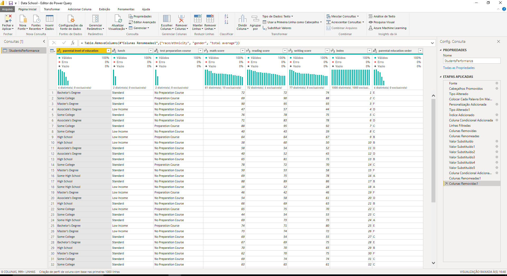

In this project I downloaded a kaggle dataset https://www.kaggle.com/spscientist/students-performance-in-exams with the performance of students from a fictional school. The following analysis was carried out assuming that the preparatory course is paid for.

After opening the file in excel to see what kind of data I was dealing with, I decided to organize the information right away.

After organizing the data, I opened the file in PowerBi and processed some data and created some relevant columns.

With the data already processed, I set up a dashboard with the intention to make an analysis about students grades at this school. Based on the results found I
came to some conclusions:

In the graph "Students participation on Test preparation course" I could see that the number of students who did not participate in the preparatory course for the tests that the
school offered was almost twice the number of students who participated.

With that in mind I made the graph "Math, reading and writing average score based on Test preparation course completion" to find out if the fact that the students who did not attended the preparatory course would have a direct influence on their grades and I realized that there was a correlation, showing that on average the students who participated in the preparatory course had a higher grade in all three subjects, which means that the course, despite the low adherence of students, shows good results.

I made the chart "Test preparation course participation based on parental level of education" to find out if there would be any relationship between the education level of the parents of each student and his participation in the preparatory course, and even though some levels of parents' education had more or less student participation, I didn't think
so relevant to build up a strategy around that.

In "Students participation on test preparation course based on family income" I realized that there was not a strong relationship between family income and the rate of students' adhesion to the preparatory course.

Based on the data above, it is clear that the cost of the course is not an impediment to your membership, since the percentage of people categorized as "low income" is very close to the percentage of people categorized as "standard income". In addition, I could also notice from the first graphics that the course delivers a good result, which would not justify its low adherence. Thus, it is possible to believe that the main problem to be solved is the low perceived value of the course by the students. Our goal, therefore, is to add value and relevance to the preparatory course. For this, our insight is to offer a free trial period to all students.
Our main thesis is that the trial period will have a direct impact on these students' grades, resulting in greater adherence.
